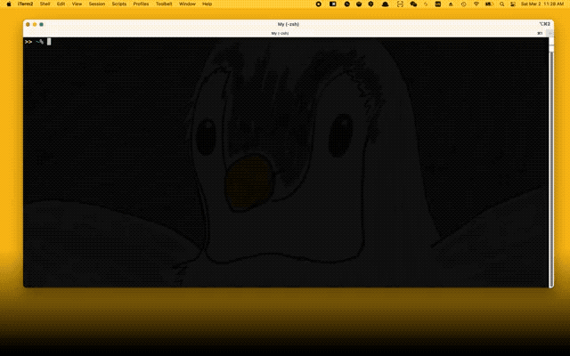

# cdbm -- cd bookmark



## Introduction

`cdbm` is a Python-based utility that bookmarks directories one wishes to `cd` quickly.

## Usage

To `cd` to the bookmark whose name matches `QUERY`, simply

```bash
cdbm QUERY
```

Full help message:


```
cdbm [OPTION | [--] <QUERY>]

OPTION (mutually exclusive)

    -h          print this message and exit
    -l          print the bookmark definitions
    -c          print the access counts of each bookmarked directory
    -e          edit the bookmark definition file
    -n <KEY>    append current working directory to bookmark definitions
    +n <KEY>    prepend current working directory to bookmark definitions
    -k          check and warn inactive bookmarks (ones that share the same keys
                as the entries defined before them)
    +k          remove inactive bookmarks
```


## Installation

1. Clone this project to `/path/to/repo`.
2. Under `/path/to/repo/` in terminal, run `BINDIR=/path/to/bin ./install.sh`, where `/path/to/bin` is where you'd like the `cdbm` executable to sit. Here, `/path/to/bin` must be an existing directory in `PATH`.
3. At the end of your bashrc or zshrc, write `eval "$(cdbm init)"`.
4. Reopen your shell to activate the configuration.

## Dependencies

OS: No plan to support Windows currently, but WSL could be (not tested) acceptable.

Python: need to have `python3` in `PATH`, with Python>=3.7.

Other binaries: [`fzf`](https://github.com/junegunn/fzf) is recommended to install, in order to enable fuzzy match of bookmark keys and interactive filtering.

## Environment variables

These environment variables can be exported to change the behavior of `cdbm`:

- `CDBM_RECORD_COUNT` (default unset): set to `1` to enable recording directory counts (see below).
- `CDBM_EDITOR` (default to `EDITOR`, or `vim` if `EDITOR` is not set): set to your favorite editor (e.g. `vim`) to be used in `cdbm -e` (see above).
- `CDBM_ECHO` (default unset): set to `1` to echo the path to `cd` before `cd`

## Files and directories

`~/.config/cdbm` directory will be created if not exists.
This directory will be used to hold:

- `~/.config/cdbm/cdbm`: The bookmark file, which defines all bookmarked directories. You may freely edit yourself. The format of each line is: either `<bookmark-key> <path>` for bookmark, or `# ...` for comment.
- `~/.config/cdbm/count`: A json file containing how many times you've used `cdbm` on each bookmarked directory.

## Companion Vim ftplugin

[cdbm.vim](cdbm.vim) (or its [repo](https://github.com/kkew3/cdbm.vim)) contains syntax highlighting definition of `~/.config/cdbm/cdbm`.
To install `cdbm.vim`, if using [`vim-plug`](https://github.com/junegunn/vim-plug), put the following to `~/.vimrc`:

```vim
Plug 'kkew3/cdbm.vim'
```

## Related projects

### Directory bookmarking

mokemokechicken [posted](https://qiita.com/mokemokechicken/items/69af0db3e2cd27c1c467) his idea on bookmarking directories in 2014, which was then extended by [mollifier's cd-bookmark](https://github.com/mollifier/cd-bookmark). huyng also authored a popular [bashmarks](https://github.com/huyng/bashmarks) project in 2014. ybda maintains [shmarks](https://github.com/ybda/shmarks) from 2023.

This project differs from the above in the support of `fzf`.

### General directory switching

[ajeetdsouza's zoxide](https://github.com/ajeetdsouza/zoxide) is a popular Rust utility whose vision is to be a smarter cd command.
It should be noted that the idea of bookmarking directories is different from Zoxide.
With bookmarking, one may alias a directory with a totally different (simpler) name.
For example, a directory might be named "机器学习" for clarity, but it's not convenient to type.
One may alias it the name "ml" in the bookmark definition, and type directly "ml" to go to that directory.
This use case cannot be achieved with Zoxide.

## Design choices

### Why not Rust

Indeed, Rust is faster, but current `cdbm` is fast enough for my use case.
